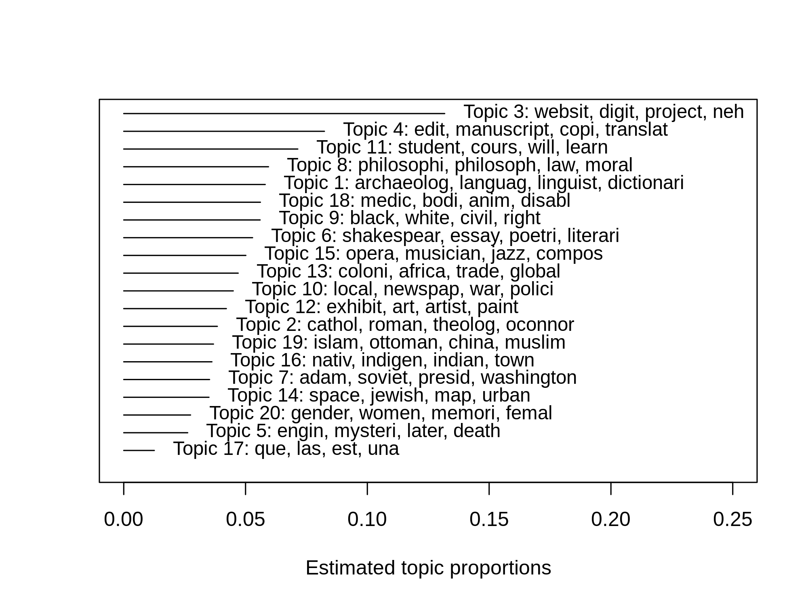
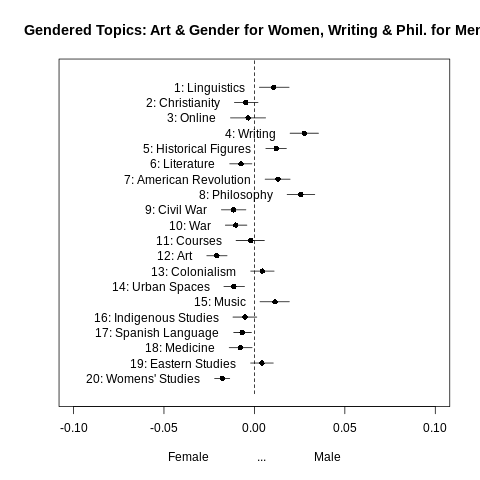
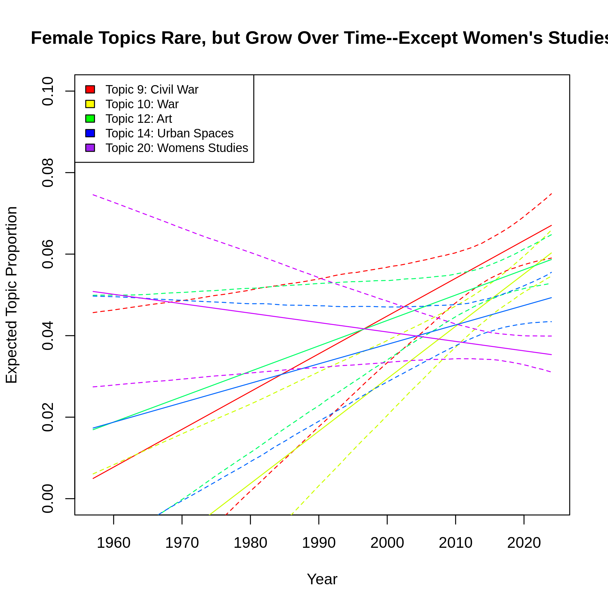
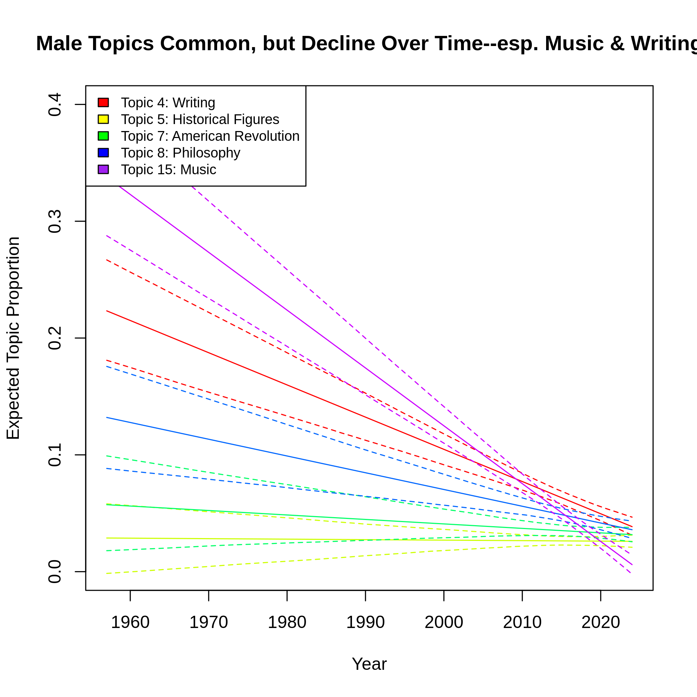

# Natural language processing on NEH grant products

This codebase applies natural language processing (NLP) to open-access data on all NEH grant products, from books to presentations to software. Guided by continuing interest in the Digital Humanities about gender differences in language and financial support and the NEH's mission of strengthening the humanities for all, my analysis tries to answer this research question:

> How have descriptions of NEH grant products changed over time, and how does their language vary by gender? 

My goal in addressing this question is to support gender equity in NEH's grant-making efforts by recognizing differences in grant products between men and women, i.e. in what they get funding to do. I specifically apply NLP to grant product descriptions in an effort to discover gendered language and how this has changed over time. 

My main tool for this analysis is topic modeling, which analyzes patterns of word associations to discover topics in a set of documents--here, author-provided grant product descriptions.


## Visualizations and takeaways

I computed a topic model using 20 topics, which allowed a set of distinct, clear topics to emerge from the text data. The topics are visualized below along with their top four distinctive words. The most common topic is 3, which I label "Online" as it pertains to websites and digital products. Similarly, I labeled all 20 topics based on their most probable and distinctive words, a typical analyst-driven step in topic modeling. For more detail on the topics' composition, see [this commented notebook in R](https://github.com/jhaber-zz/neh-nlp/blob/main/code/topic_modeling.ipynb). 



The plot below displays the gender associations for all 20 topics. Topics further to the right are associated with male authors, while topics further to the left are more typical of female authors. Some topics don't diverge much by gender, such as the Courses topic (number 11, with distinctive words like _student_, _course_, and _learn_), while others are more typical of male authors (especially the Writing and Philosophy topics) and still others are more common among female authors (e.g., the Art and Womens' Studies topics).



The plot below shows how topics more common among women authors change over time. These topics are relatively rare compared to male authors (see the next plot below), but they are also becoming more prevalent over time--with the sole exception of the Womens' Studies topic, which declines slightly or stays steady (the association with time is insignificant; [see the model output](https://github.com/jhaber-zz/neh-nlp/blob/main/output/estimate_topic_effects.csv)). 



In contrast, topics associated with male authors are relatively common but decline over time, especially the Music and Writing topics (4 and 15, respectively). The Philosophy topic (number 8) is strongly male-associated, relatively common (its level hovers around 0.1), and declines only slightly over time (again, [see the model output](https://github.com/jhaber-zz/neh-nlp/blob/main/output/estimate_topic_effects.csv) for coefficient values).




## Method details

For the topic modeling portion of this analysis, I used [Structural Topic Modeling in R](https://www.structuraltopicmodel.com/). This approach allows the model to consider document metadata (here, author gender and year of the grant product) when creating topics. 

I used the [gender-guesser package in Python](https://pypi.org/project/gender-guesser/) to infer gender for each author based on their first names. Names labeled by the algorithm as "male" or "mostly male" I took to be male, while names labeled as "female" or "mostly female" I took as female. See details on my processing workflow in [this commented Python notebook](https://github.com/jhaber-zz/neh-nlp/blob/main/code/prepare_data.ipynb).

For simplicity, I dropped any cases missing a grant product description ("Abstract") or year of product completion/release ("Year") or that had a gender-nonspecific first name (i.e., those labeled by gender-guesser as "unknown"). Access to authors' internal demographic data would allow a more robust analysis and a better approach to missing data. 

While I did not analyze (yet) how the relationships between gender and topics themselves change over time, this would be a promising avenue for future work.


## Codebase overview: Key folders and contents

```bash
├── code # All scripts used in analysis
│   ├── prepare_data.ipynb # Imports NEH Grant Product data from data.gov, combines the different product types into one DataFrame, infers author gender, and cleans and filters data to prepare for natural language processing
│   ├── topic_modeling.ipynb # Estimates Structural Topic Model, visualizes model topics, and analyzes associations between topics and author gender
│   └── utils.py # Convenience functions for notebooks, e.g. extracting zip files and cleaning text
├── data # Raw and processed data on NEH Grant Products
│   ├── NEH_GrantProducts # Folder holding the raw, open data from data.gov (.xml and .xsd files)
│   ├── NEH_GrantProducts_Prepared.tsv # Cleaned and combined dataset with NEH Grant Products' ID, Abstract, Year, and ProductType; any cases missing data were removed
│   └── NEH_GrantProducts_Prepared_w_Gender.tsv # Cleaned and combined dataset with NEH Grant Products' ID, Abstract, Year, ProductType, and Gender; any cases missing data were removed, including gender-nonspecific first names
└── output
    ├── corrviz.html # Interactive file to see clusters of topics based on correlations
    ├── corrviz.png # Static file showing topic correlations
    ├── estimate_topic_effects.csv # Shows beta coefficients for all 20 topics in linear regression predicting topic prevalence using gender & year
    ├── female_topics_over_time.png # Shows prevalence over time for topics more common in works by female authors, using simple linear regression
    ├── female_topics_over_time_loess.png # # Shows prevalence over time for topics more common in works by female authors, using local regression (LOESS) to allow curves
    ├── gender_and_topics.png # Shows associations between topics and predicted author gender
    ├── male_topics_over_time.png # # Shows prevalence over time for topics more common in works by male authors, using simple linear regression
    ├── male_topics_over_time_loess.png # # Shows prevalence over time for topics more common in works by female authors, using local regression (LOESS) to allow curves
    ├── topic_contrast_writing_womens-studies.png # Contrasts a male-specific topic (Writing) with a female-specific topic (Womens' Studies)
    ├── topic_frequencies.png # Shows top topics and their distinctive words (without my labels)
    ├── topic_model_k20.RData # Structural Topic Model using 20 topics
    └── wordcloud.png # Simple word cloud showing most common words (stemmed) in corpus; words are scaled bv frequency
```

## Sources and Acknowledgments

* [Data source: NEH on `data.gov`](https://catalog.data.gov/organization/neh-gov)
* Code snippets and inspiration borrowed from [data science work I led with multiple project teams](https://github.com/comp-strat/text_analysis/tree/master/topic_modeling) and [this vignette for the STM package in R](https://cran.r-project.org/web/packages/stm/vignettes/stmVignette.pdf) 
