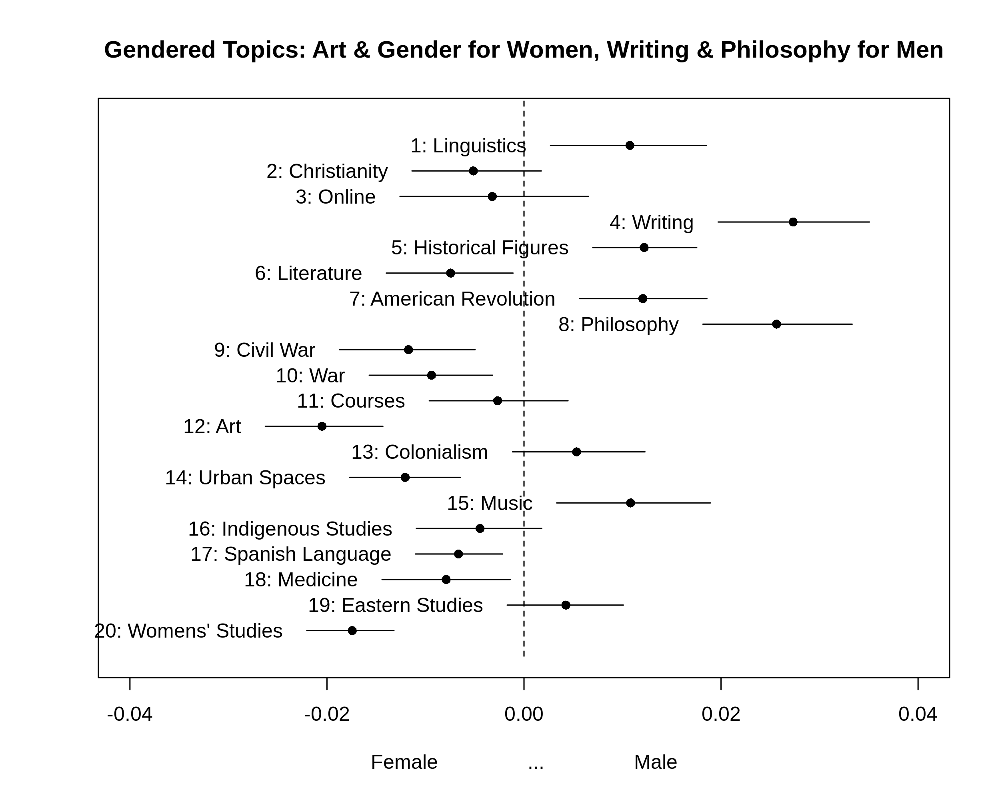

# Natural language processing on NEH grant products

Text of code overview/report here


## Visualizations and takeaways

Something about topic model in general, what topics it produces


Something about gender



Female Topics Rare, but Grow Over Time--Except Women's Studies
"Topic 9: Civil War", "Topic 10: War", "Topic 12: Art", "Topic 14: Urban Spaces", "Topic 20: Womens Studies"


Male Topics Common, but Decline Over Time--esp. Music & Writing
"Topic 4: Writing", "Topic 5: Historical Figures", "Topic 7: American Revolution", "Topic 8: Philosophy", "Topic 15: Music"


## Codebase overview: Key folders and contents

```bash
├── code # All scripts used in analysis
│   ├── prepare_data.ipynb # Imports NEH Grant Product data from data.gov, combines the different product types into one DataFrame, infers author gender, and cleans and filters data to prepare for natural language processing
│   ├── topic_modeling.ipynb # Estimates Structural Topic Model, visualizes model topics, and analyzes associations between topics and author gender
│   └── utils.py # Convenience functions for notebooks, e.g. extracting zip files and cleaning text
├── data # Raw and processed data on NEH Grant Products
│   ├── NEH_GrantProducts # Folder holding the raw, open data from data.gov (.xml and .xsd files)
│   ├── NEH_GrantProducts_Prepared.tsv # Cleaned and combined dataset with NEH Grant Products' ID, Abstract, Year, and ProductType; any cases missing data were removed
│   └── NEH_GrantProducts_Prepared_w_Gender.tsv # Cleaned and combined dataset with NEH Grant Products' ID, Abstract, Year, ProductType, and Gender; any cases missing data were removed, including gender-nonspecific first names
└── output
    ├── corrviz.html # Interactive file to see clusters of topics based on correlations
    ├── corrviz.png # Static file showing topic correlations
    ├── estimate_topic_effects.csv # Shows beta coefficients for all 20 topics in linear regression predicting topic prevalence using gender & year
    ├── female_topics_over_time.png # Shows prevalence over time for topics more common in works by female authors, using simple linear regression
    ├── female_topics_over_time_loess.png # # Shows prevalence over time for topics more common in works by female authors, using LOESS regression to allow curves
    ├── gender_and_topics.png # Shows associations between topics and predicted author gender
    ├── male_topics_over_time.png # # Shows prevalence over time for topics more common in works by male authors, using simple linear regression
    ├── male_topics_over_time_loess.png # # Shows prevalence over time for topics more common in works by female authors, using LOESS regression to allow curves
    ├── topic_contrast_writing_womens-studies.png # Contrasts a male-specific topic (Writing) with a female-specific topic (Womens' Studies)
    ├── topic_frequencies.png # Shows top topics and their distinctive words (without my labels)
    ├── topic_model_k20.RData # Structural Topic Model using 20 topics
    └── wordcloud.png # Simple word cloud showing most common words (stemmed) in corpus; words are scaled bv frequency
```

## Method details

Something about STM model
About Loess regression

How I inferred gender

Something about dropping missing cases and when these tend to be


## Future work

Would be great to have demographic data om authors, like race and gender, or where they live, or fields of study, etc.

Would be great to look at interactions, like how does the gender/topic relationship change over time?


## Sources and Acknowledgments

* [Data source: NEH on `data.gov`](https://catalog.data.gov/organization/neh-gov)
* Code snippets and inspiration borrowed from [data science work I led with multiple project teams](https://github.com/comp-strat/text_analysis/tree/master/topic_modeling) and [this vignette for the STM package in R](https://cran.r-project.org/web/packages/stm/vignettes/stmVignette.pdf) 
